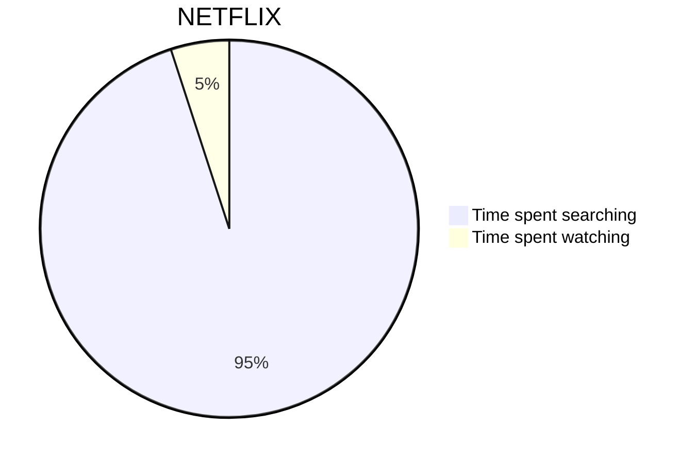
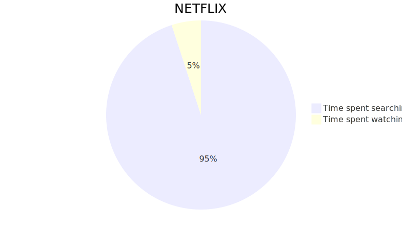

# Ningyo

🧜‍♀️ Because we like [Mermaid](https://mermaid.js.org/)s - but Bitbucket and Confluence don't... 🙄

Turns this

~~~markdown

~~~

into this



## Usage

Put your diagram(s) in Markdown files and pass their filenames as parameters to ningyo:

```shell
npx @defaude/ningyo foo.md bar.md baz.md
```

Look at [the reference](https://mermaid.js.org/intro/n00b-syntaxReference.html) to see what you can do with Mermaid.

Sadly, there are no network / cloud diagrams available at the moment, but with a little effort, it _might_ become
reality [some time in the future](https://github.com/mermaid-js/mermaid/issues/1227).

By the way: The generated SVG images will be optimized with [svgo](https://github.com/svg/svgo) ✌️
